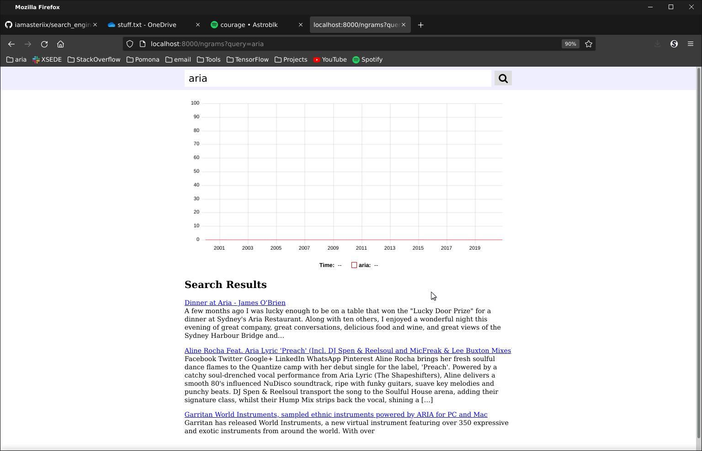

# Search Engine

Highly scalable web search engine.

**Objectives:**
1. [x] Parallelize data analysis work off the database
1. [x] Work with WARC files and the multi-petabyte common crawl dataset
1. [x] Create indices and rollup tables for speeding up queries
1. [x] Debug database performance problems

## Project setup

Fork this repo and clone your fork recursively onto your machine. Ensure that you have enough free disk space in your hard drive as we will be working
 with potentially hundreds of gigs of data.


## Getting the system running

First, bring up all the docker containers and verify that everything works.

There are three `docker-compose` files in this repo:
1. `docker-compose.yml` defines the database and pg_bouncer services.
1. `docker-compose.override.yml` defines the development flask web app.
1. `docker-compose.prod.yml` defines the production flask web app served by nginx.

To get the system running, you need to:

1. Run the script `scripts/create_passwords.sh` to generate the file `.env.prod` containing production credentials for the database. Recall that this file 
is sensitive and should not be added to your git repo for any reason.

1. Modify the `docker-compose.override.yml` file so that the port exposed by the flask service is the same as your [docker userid](https://docs.docker.com/engine/security/userns-remap/).

1. Build and bring up the docker containers by running the commands
    ```
    $ docker-compose build
    $ docker-compose up -d
    ```
    Note that the containers have many dependencies, and so building them the first time can take an hour or more. Further recall that when the `-f` 
    command line flag is not specified, then `docker-compose` will use both the `docker-compose.yml` and `docker-compose.override.yml` configuration 
    files, but will not use the `docker-compose.prod.yml` configuration file. For the purpose of this project, you won't need to use the production file.

1. Verify that you can connect to your database by running the command:
    ```
    $ docker-compose exec pg psql --user=novichenko
    ```

    > **Historical Note:**
    > Notice that the database username (as defined in the `.prod.env` file) is `novichenko` and not `postgres` or `root`.
    > [Novichenko](https://en.wikipedia.org/wiki/One_Second_for_a_Feat) was a Soviet military officer who saved Kim Il Sung from a grenade assassination attempt.

1. Enable ssh port forwarding so that your local computer can connect to the running flask app.

1. Use a browser on your local computer to connect to the running flask webpage. If you've done the previous steps correctly, all the buttons on the 
webpage should work without giving you any error messages, but there won't be any data displayed when you search.

1. Edit the script `scripts/check_web_endpoints.sh` so that the port that the script connects to matches the port that the flask server is exposed to 
on the `docker-compose.overrider.yml` file.

   Then, run the script
   ```
   $ sh scripts/check_web_endpoints.sh
   ```
   to perform automated integration checks that the system is running correctly.
   All tests should report `[pass]`.


## Loading data

There are two services for loading data:
1. `downloader_warc` loads an entire WARC file into the database; typically, this will be about 100,000 urls from many different hosts. 
1. `downloader_host` searches the all WARC entries in either the common crawl or internet archive that match a particular pattern, and adds all of them into the database

### Task 2a

We'll start with the `downloader_warc` service.
There are two important files in this service:
1. `services/downloader_warc/downloader_warc.py` contains the python code that actually does the insertion
1. `downloader_warc.sh` is a bash script that starts up a new docker container connected to the database, then runs the `downloader_warc.py` file inside that container

Next follow these steps:
1. Visit <https://commoncrawl.org/the-data/get-started/>
1. Find the url of a WARC file.
   On the common crawl website, the paths to WARC files are referenced from the Amazon S3 bucket.
   In order to get a valid HTTP url, you'll need to prepend `https://data.commoncrawl.org/` to the front of the path.
1. Then, run the command
   ```
   $ ./downloader_warc.sh $URL
   ```
   where `$URL` is the url to your selected WARC file.

   This command will spawn a docker container that downloads the WARC file and inserts it into the database.
   Run the command
   ```
   $ docker ps
   ```
   to verify that the docker container is running.
   Since it is downloading and processing a 1GB file, this container will run for a long time.
   Once the WARC file is fully downloaded, the container will automatically stop itself.

   > **Note:**
   > The first time this script is run, a docker image is built.
   > Building this image takes a long time (potentially hours), and so the first run of this script will be slow.
   > Subsequent runs do not have to rebuild the container from scratch and will be much faster.

1. Repeat these steps to download at least 5 different WARC files, each from different years.
   Each of these downloads will spawn its own docker container and can happen in parallel.

You can verify that your system is working with the following tasks.
(Note that they are listed in order of how soon you will start seeing results for them.)
1. Running `docker logs` on your `downloader_warc` containers.
1. Run the query
   ```
   SELECT count(*) FROM metahtml;
   ```
   in psql.
1. Visit your webpage in firefox and verify that search terms are now getting returned.

### Task 2b

The `downloader_warc` service above downloads many urls quickly, but they are mostly low-quality urls.
For example, most URLs do not include the date they were published, and so their contents will not be reflected in the ngrams graph.
In this task, you will implement and run the `downloader_host` service for downloading high quality urls.

1. The file `services/downloader_host/downloader_host.py` has 3 `FIXME` statements.
   You will have to complete the code in these statements to make the python script correctly insert WARC records into the database.

   > **HINT:**
   > The code will require that you use functions from the cdx_toolkit library.
   > You can find the documentation [here](https://pypi.org/project/cdx-toolkit/).
   > You can also reference the `downloader_warc` service for hints,
   > since this service accomplishes a similar task.

1. Run the query
   ```
   SELECT * FROM metahtml_test_summary_host;
   ```
   to display all of the hosts for which the metahtml library has test cases proving it is able to extract publication dates.
   Note that the command above lists the hosts in key syntax form, and you'll have to convert the host into standard form.
1. Select 5 hostnames from the list above, then run the command
   ```
   $ ./downloader_host.sh "$HOST"
   ```
   to insert the urls from these 5 hostnames.

## Task 3: speeding up the webpage

Every time you run a web search on this website, several sql queries are run.
In particular, the full text search is run using a query that contains something like
```
to_tsvector() @@ to_tsquery()
```
in its where clause.
There is currently no index to speed up this query.
So the query will use a sequential scan and the runtime will be linear in the amount of data searched.

That's bad!

Your goal in this task is to create an index that speeds up the query.
It should be a RUM index to speed up the `@@` operator and take advantage of a `LIMIT` clause using an index scan.
The RUM index is already installed on this pg instance,
and that's one of the reason building the images took a long time.

The problem is that I'm not going to tell you what the query is that you need to speed up.
And there's a LOT of code to try to search through... so it's impractical to find the python that causes this query.

Instead, we'll use postgres to tell us what queries are slow without needing to search through the code.
Postgres maintains a relation called `pg_stat_statements` which records the performance of all queries that get run.
You can find a tutorial for using this relation at <https://www.cybertec-postgresql.com/en/postgresql-detecting-slow-queries-quickly/>.

Running the following query in psql will give you the most expensive queries that have been run on the database:
```
SELECT query,
      calls,
      round(total_exec_time::numeric, 2) AS total_time,
      round(mean_exec_time::numeric, 2) AS mean_time,
      round((100 * total_exec_time / sum(total_exec_time) OVER ())::numeric, 2) AS percentage
FROM pg_stat_statements
ORDER BY total_exec_time DESC;
```
If you run this query, you'll see that it contains MANY results inside of it because there are many queries that have been run on the database.

In order to find our text search query, modify the `SELECT` statement above to add a `WHERE` clause that requires that the query contain the `@@` symbol.
Now you should see as the first result the `SELECT` query that does full text search on your webpage.
You can verify this by running a few more queries on the webpage and checking that the `calls` column in the `SELECT` query goes up.

Now that you know what the query looks like, write a RUM index to speed up this query.
(One fact that you need which may not be included in the results of your `SELECT` query is that the language parameter to `to_tsquery` is `'simple'`.)

Add this RUM index to your `services/pg/sql/schema.sql` file and run it directly in psql.
You should notice when you run a search, the runtimes of the searches are now faster.

<!--
Since I've given out a lot of work at this point, I don't want to overwhelm you, and I've done this step for you.

There are two steps:
1. create indexes for the fast text search
1. create materialized views for the `count(*)` queries
-->

## Submission

1. Edit this README file to contain the RUM query you created above right here:
    ```
    create index on metahtml using rum(content);
    create index on metahtml using rum(title);
    ```

1. Edit this README file with the results of the following queries in psql.
   The results of these queries will be used to determine if you've completed the previous steps correctly.

    1. This query shows the total number of webpages loaded:
       ```
       select count(*) from metahtml;

         count
        --------
         220772
         (1 row)
       ```

    1. This query shows the number of webpages loaded / hour:
       ```
       select * from metahtml_rollup_insert order by insert_hour desc limit 100;

          hll_count |  url   | hostpathquery | hostpath |  host  |      insert_hour
         -----------+--------+---------------+----------+--------+------------------------
                  5 | 206176 |        208662 |   205593 | 146306 | 2022-05-11 23:00:00+00
                  1 |  12577 |         12830 |    12587 |  11484 | 2022-05-11 22:00:00+00
         (2 rows)
       ```

    1. This query shows the hostnames that you have downloaded the most webpages from:
       ```
       select * from metahtml_rollup_host2 order by hostpath desc limit 100;

         url | hostpathquery | hostpath |            host
        -----+---------------+----------+----------------------------
          74 |            74 |       74 | com,smugmug,photos)
          54 |            54 |       54 | org,wikipedia,en)
          65 |            65 |       50 | com,mlb)
          49 |            49 |       49 | com,tv)
          46 |            46 |       46 | com,popsugar)
          46 |            46 |       46 | com,wsj)
          45 |            45 |       45 | com,pinterest,nl)
          42 |            42 |       42 | org,worldcat)
          42 |            42 |       42 | com,goal)
          42 |            42 |       42 | com,6pm)
          40 |            40 |       40 | com,meetup)
          40 |            40 |       40 | net,slideshare)
          38 |            38 |       38 | com,pandora)
          38 |            38 |       38 | com,github)
          38 |            38 |       38 | com,threadless)
          37 |            37 |       37 | com,tripadvisor)
          37 |            37 |       37 | net,behance)
          36 |            36 |       36 | com,gamefaqs)
          36 |            36 |       36 | com,dreamstime)
          35 |            35 |       35 | com,healthgrades)
          35 |            35 |       35 | com,yam,n)
          35 |            35 |       35 | com,staples)
          35 |            35 | org,wikipedia,es)
          36 |            36 |       35 | com,snagajob)
          35 |            35 |       35 | org,wikipedia,ru)
          39 |            39 |       34 | com,starizona)
          34 |            34 |       34 | com,engadget)
          33 |            33 |       33 | org,wikipedia,it)
          35 |            35 |       33 | com,businessinsider)
          33 |            33 |       32 | com,packersproshop)
          32 |            32 |       32 | com,theguardian)
          32 |            32 |       32 | com,agoda)
          32 |            32 |       32 | net,cl-user)
          32 |            32 |       32 | com,zappos)
          32 |            32 |       32 | com,bookdepository)
          31 |            31 |       31 | com,vimeo)
          31 |            31 |       31 | com,iheart)
          31 |            31 |       31 | org,wikipedia,de)
          31 |            31 |       31 | jp,atwiki)
          31 |            31 |       31 | il,co,tapuz)
          31 |            31 |       31 | com,douban,book)
          30 |            30 |       30 | com,dailymotion)
          30 |            30 |       30 | org,votesmart)
          32 |            32 |       30 | com,imdb)
          32 |            32 |       30 | com,dafont)
          30 |            30 |       30 | com,economist)
          30 |            30 |       30 | com,foxnews)
          38 |            38 |       30 | org,npr)
          29 |            29 |       29 | net,sourceforge)
          29 |            29 |       29 | com,newgrounds)
          29 |            29 |       29 | tv,nimo)
          29 |            29 |       29 | com,bonhams)
          29 |            29 |       29 | com,thestreet)
          29 |            29 |       29 | com,ubuntu,packages)
          30 |            30 |       29 | com,llbean)
          39 |            39 |       29 | com,gamestop)
          29 |            29 |       29 | com,upi)
          28 |            28 |       28 | edu,jhu,engineering)
          28 |            28 |       28 | com,tripadvisor,no)
          28 |            28 |       28 | com,nypost)
          28 |            28 |       28 | org,wiktionary,en)
          37 |            37 |       28 | org,summitpost)
          28 |            28 |       28 | com,gizmodo)
          27 |            27 |       27 | com,oracle,docs)
          27 |            27 |       27 | jp,co,mapion)
          28 |            28 |       27 | net,fanfiction)
          30 |            30 |       27 | com,nytimes)
          30 |            30 |       27 | com,nordstrom,shop)
          33 |            33 |       27 | com,ice)
          27 |            27 |       27 | org,marylandpublicschools)
          33 |            33 |       27 | com,stackoverflow)
          27 |            27 |       27 | jp,askdoctors)
          48 |            48 |       27 | com,grabcad)
          27 |            27 |       27 | com,bleacherreport)
          27 |            27 |       27 | com,nadaguides)
          26 |            26 |       26 | gov,ok,digitalprairie)
          26 |            26 |       26 | com,imgur)
          26 |            26 |       26 | org,metoperashop)
          26 |            26 |       26 | com,dw)
          26 |            26 |       26 | se,tripadvisor)
          26 |            26 |       26 | org,wikipedia,pl)
          26 |            26 |       26 | com,blackhatworld)
          26 |            26 |       26 | com,garmin,activecaptain)
          26 |            26 |       26 | il,co,net-games)
          42 |            42 |       26 | com,fool,boards)
          26 |            26 |       26 | com,scribdassets,imgv2-3)
          26 |            26 |       26 | com,movellas)
          26 |            26 |       26 | com,keezmovies)
          25 |            25 |       25 | com,w3techs)
          25 |            25 |       25 | com,stackexchange)
          26 |            26 |       25 | gov,nih,nlm,ncbi,pubchem)
          25 |            25 |       25 | com,dreamstime,pt)
          44 |            44 |       25 | org,archive)
          31 |            31 |       25 | uk,co,ebay)
          25 |            25 |       25 | com,cheezburger)
          34 |            34 |       25 | com,bloomberg)
          30 |            30 |       25 | com,cnet)
          30 |            30 |       25 | com,tvguide)
          25 |            25 |       25 | com,songlyrics)
          25 |            25 |       25 | ve,com,tripadvisor)
        (100 rows)
       ```

1. Take a screenshot of an interesting search result.
   Ensure that the timer on the bottom of the webpage is included in the screenshot.
   Add the screenshot to your git repo, and modify the `` tag below to point to the screenshot.

   
